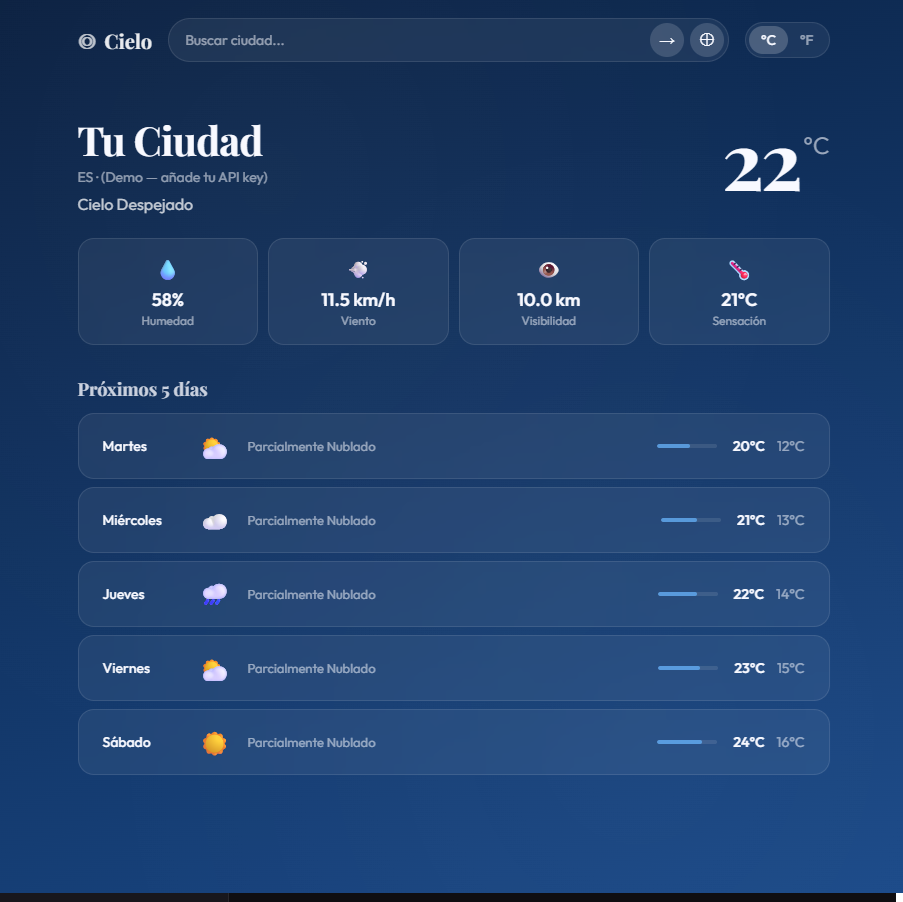

# ◎ Cielo — App del Tiempo

Una aplicación del tiempo elegante con fondo dinámico que cambia según las condiciones meteorológicas. Construida con HTML, CSS y JavaScript vanilla.



## ✨ Características

- **Tiempo en tiempo real** con la API de OpenWeatherMap
- **Geolocalización** — detecta automáticamente tu ubicación
- **Búsqueda con autocompletado** de ciudades
- **Previsión de 5 días** con iconos y temperaturas
- **Fondo dinámico animado** — cambia según clima y hora del día (sol, lluvia, nieve, estrellas)
- **Partículas animadas** — lluvia, nieve o estrellas según el tiempo
- **Cambio °C / °F** instantáneo
- **Modo demo** — funciona sin API key para mostrar el diseño

## 🛠️ Tecnologías

- HTML5 (Geolocation API)
- CSS3 (variables, animaciones, backdrop-filter, transitions)
- JavaScript ES6+ (async/await, Fetch API, módulos)
- [OpenWeatherMap API](https://openweathermap.org/api) (gratuita)

## 🚀 Cómo ejecutarlo

1. **Obtén una API key gratuita** en [openweathermap.org](https://openweathermap.org/api)

2. **Clona el repositorio:**
   ```bash
   git clone https://github.com/tu-usuario/cielo-weather.git
   cd cielo-weather
   ```

3. **Añade tu API key** en `app.js`:
   ```javascript
   const API_KEY = 'tu_api_key_aqui';
   ```

4. Abre `index.html` en tu navegador o usa un servidor local.

   > **Nota:** La geolocalización requiere HTTPS o localhost.

## 📁 Estructura del proyecto

```
cielo-weather/
├── index.html    # Estructura de la app
├── style.css     # Estilos y animaciones
├── app.js        # Lógica, API calls, fondo dinámico
└── README.md
```

## 🎨 Escenas según el clima

| Condición | Fondo | Partículas |
|-----------|-------|-----------|
| Despejado (día) | Azul cielo | Ninguna |
| Despejado (noche) | Azul noche | Estrellas ✨ |
| Lluvia | Gris azulado | Gotas de lluvia 🌧 |
| Tormenta | Oscuro | Lluvia intensa ⛈ |
| Nieve | Gris claro | Copos de nieve ❄️ |
| Nublado | Gris | Ninguna |

## 💡 Decisiones técnicas

- **Vanilla JS**: sin React ni Vue, para mantener la complejidad mínima y demostrar dominio del DOM.
- **CSS custom properties**: permiten cambiar el tema del fondo con una sola asignación de variable.
- **Promise.all()**: las llamadas a weather y forecast se hacen en paralelo para reducir tiempos de carga.
- **Modo demo**: cuando no hay API key, muestra datos ficticios para poder enseñar el diseño en una entrevista.

## 🔭 Posibles mejoras

- Gráfica de temperatura de las próximas 24h
- Histórico de ciudades visitadas
- Mapa de radar meteorológico
- PWA con notificaciones de alertas climáticas
