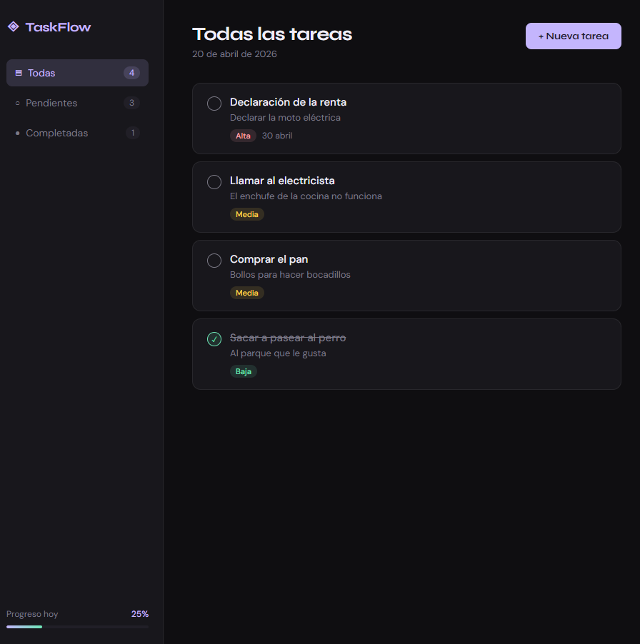

# ◈ TaskFlow — Gestor de Tareas

Una aplicación de gestión de tareas minimalista y funcional construida con HTML, CSS y JavaScript puro.



## ✨ Características

- **CRUD completo** — crear, editar, marcar como hecha y eliminar tareas
- **Prioridades** — alta, media y baja con colores diferenciados
- **Fechas límite** — con indicador de tareas vencidas
- **Filtros** — ver todas, pendientes o completadas
- **Drag & Drop** — reordena tareas arrastrándolas
- **Persistencia** — los datos se guardan en `localStorage`
- **Diseño responsive** — funciona en móvil y escritorio
- **Barra de progreso** — visualiza cuántas tareas has completado hoy

## 🛠️ Tecnologías

- HTML5 semántico
- CSS3 (variables CSS, grid, flexbox, animaciones)
- JavaScript ES6+ (sin dependencias externas)
- localStorage para persistencia de datos
- Drag & Drop API nativa del navegador

## 🚀 Cómo ejecutarlo

1. Clona el repositorio:
   ```bash
   git clone https://github.com/tu-usuario/taskflow.git
   cd taskflow
   ```

2. Abre `index.html` en tu navegador (no necesita servidor).

   O usa Live Server en VSCode para desarrollo.

## 📁 Estructura del proyecto

```
taskflow/
├── index.html    # Estructura HTML y modal
├── style.css     # Estilos, tema oscuro, animaciones
├── app.js        # Lógica de la aplicación
└── README.md
```

## 💡 Decisiones técnicas

- **Sin frameworks**: proyecto intencionalmente vanilla para demostrar dominio del DOM y JS puro.
- **localStorage**: persistencia sin necesidad de backend, suficiente para una app de tareas personal.
- **Drag & Drop nativo**: se usa la API `draggable` del HTML5 para evitar librerías externas.
- **CSS variables**: facilitan el mantenimiento del tema y podrían soportar modo claro en el futuro.

## 🔭 Posibles mejoras futuras

- Backend con Node.js + Express y autenticación JWT
- Sincronización multi-dispositivo con base de datos
- Categorías/etiquetas personalizadas
- Notificaciones de tareas próximas a vencer
- Modo claro/oscuro
