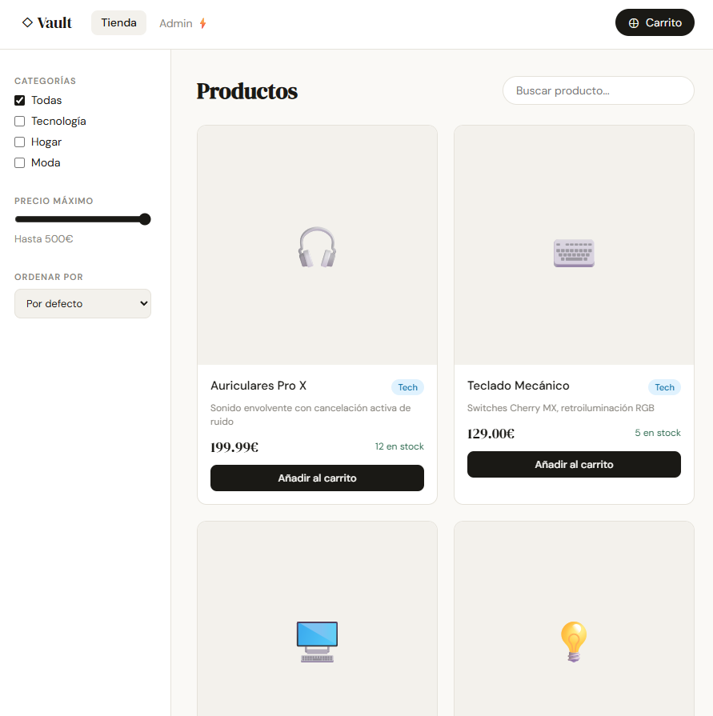

# ◇ Vault — E-commerce con Panel de Administración

Una tienda online completa con carrito de compras, filtros avanzados y panel de administración. Construida con HTML, CSS y JavaScript vanilla.



## ✨ Características

### 🛍️ Tienda
- Catálogo de productos con grid responsive
- **Filtros** por categoría, precio máximo y búsqueda en tiempo real
- **Ordenación** por precio o nombre
- Indicador de stock disponible
- Animaciones de entrada en los productos

### 🛒 Carrito
- Panel lateral animado
- Control de cantidad por producto
- Total en tiempo real
- Persistencia en `localStorage` (el carrito se mantiene al recargar)
- Simulación de checkout

### ⚡ Panel de administración
- **Dashboard** con métricas: productos, pedidos, ingresos y stock total
- Tabla de productos con estado de stock
- **CRUD completo** — añadir, editar y eliminar productos
- Alerta visual para productos con stock bajo

## 🛠️ Tecnologías

- HTML5 semántico
- CSS3 (grid, variables, transiciones, panel deslizante)
- JavaScript ES6+ (módulos, localStorage, manipulación del DOM)
- Sin dependencias externas

## 🚀 Cómo ejecutarlo

1. Clona el repositorio:
   ```bash
   git clone https://github.com/tu-usuario/vault-ecommerce.git
   cd vault-ecommerce
   ```

2. Abre `index.html` directamente en el navegador — no requiere servidor.

## 📁 Estructura del proyecto

```
vault-ecommerce/
├── index.html    # Estructura, páginas de shop/admin, modales
├── style.css     # Estilos del tema, panel del carrito, grid
├── app.js        # Lógica de tienda, carrito y panel admin
└── README.md
```

## 💡 Decisiones técnicas

- **SPA sin router**: el cambio entre páginas (tienda/admin) se gestiona ocultando/mostrando divs, sin librerías de enrutamiento.
- **localStorage como base de datos**: en producción se reemplazaría por llamadas a una API REST con Node.js + Express + MySQL.
- **Filtros en cliente**: toda la lógica de filtrado/ordenación ocurre en JS sin necesidad de llamadas al servidor, adecuado para catálogos medianos.
- **Diseño editorial**: tipografía serif para la marca, sans-serif para el contenido, paleta neutral para que los productos destaquen.

## 🔭 Versión full-stack (posibles mejoras)

- Backend con **Node.js + Express** y API REST
- Base de datos **MySQL** con tablas: products, orders, users
- Autenticación con **JWT** y roles (usuario / admin)
- Integración con **Stripe** para pagos reales
- Panel de administración con gráficas de ventas
- Historial de pedidos por usuario
